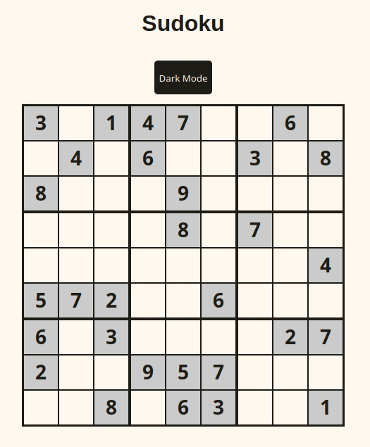

# Sudoku

A simple sudoku game written using React functional components in TypeScript.

**Objective**
Complete the grid so that each row, column, and 3x3 block contains the digits from 1 to 9; no duplicates are allowed.

**Features:**
- Arrow key-based navigation.
- Highlighting of selected cell's row, column, and 3x3 block.
- Highlighting of duplicates in the same row, column, and 3x3 block.
- Highlighting of cell's outside of the selected cell's peer groups when their value is equal.
- Notes: Enter multiple digits into a cell to store a list of candidate values for that cell. When a cell has multiple values, the text size is decreased.
- Dark mode support via CSS media queries and dynamic switching; selection saved per-user in localStorage.

**Planned Features:**
- Deterministic sudoku board generator (as a separate package).
- Support for saving game state (query param & localstorage), importing and exporting game state.
- Animating wins.
- Improved accessibility. Current scope only reads selected cell's location and value. It would be helpful to know the value of other cells in the same row/column/box, and perhaps even other rows/columns/boxes somehow?. Also consider disabled cells which are currently unreachable via screenreader.

**Unplanned Features:**
- Automatic removal of digits in notes when their location has been found (requires changing solving logic to check against solved state).
- Support for themeing (I'm not good at picking colors yet. One option would be free-for-all color selection via debug-mode color picker & saving that state for users.)
- Support for undo/redo (state is pretty easy to manipulate in this way, but unclear with it offers for a sudoku game).

**Immediate TODOs:**
- Make fully responsive (with reasonable minimum width).
- Saving game state with options to restart/export/load.
- Fix flash of default (light) theme when localStorage contains dark theme preference (likely requires moving theme switching to a separate, non-React script so it can execute before the DOM is fully rendered.)

## Live Version
A playable version is available here [https://bhm.sh/sudoku](https://bhm.sh/sudoku).

## Available Scripts

Once you've checked out the code, in the project directory, you can run:

### `npm start`

To run the app in the development mode.\
Open [http://localhost:3000](http://localhost:3000) to view it in the browser.